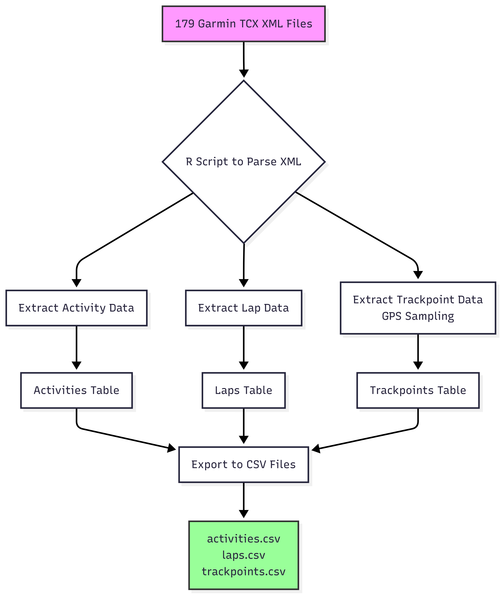

# -WIP-Running-Analysis-with-GenAI-User-engagement-on-Nike-fitness-app
# Background 
Nike Run Club is a free fitness and activity tracking app for runners at all levels. The app functions as a running coach, community, and fitness tracker, claiming to be "everything you need to start running, keep running, and enjoy running more."

For the past three years, I've collected my running data using only the Nike Run Club app. It's reliable and easy to use, and with it I've felt significant progress in my running. It's helped me develop considerably as a runner and gain valuable knowledge on how to maintain consistency and improve performance. Recently, however, I stopped running for a period due to lower leg pain. I often tend to get shin splints, one of the most common overuse injuries for runners. When this happens, I put a stop to running, which hinders my progress for a while.

Though I've made changes such as upgrading my running shoes, taking longer rest periods, and incorporating strength training, I'm still prone to overuse injuries, as evidenced by this recent running hiatus. This time, I wanted to dig into my running data itself and analyze my running behavior to see if I could spot insights that might indicate when I'm overworking my legs and examine my overall patterns as a runner over the years.

# Data
This analysis uses 3 years of personal running data collected through the Nike Run Club app, exported in Garmin TCX (Training Center XML) format. The dataset contains 179 individual workout files spanning my running journey and injury patterns.

## Data Processing Pipeline

Converting the raw XML files into analysis-ready format required handling complex, nested data structures with XML namespaces:

**Data Structure**

The processing creates three relational tables optimized for running behavior analysis:

**Activities Table** - High-level workout summaries (179 records)
- Workout duration, distance, calories, max speed
- Start times for temporal analysis of training frequency
- Sport type and user notes about workout quality

**Laps Table** - Segment-level performance data 
- Pace and intensity variations within workouts
- Average cadence for running form analysis
- Trigger methods (manual vs automatic splits)

**Trackpoints Table** - GPS and sensor measurements (sampled)
- Speed and pace variations for overexertion detection
- Cadence patterns that may indicate form breakdown
- Heart rate data for training intensity analysis

**Data Privacy Considerations**

GPS coordinates and detailed location trackpoints are excluded from this repository to protect personal location data. The analysis focuses on performance metrics, temporal patterns, and physiological data that can reveal training behaviors without compromising privacy.

**Technical Approach**

This data processing demonstrates collaborative problem-solving with AI assistance to handle complex XML parsing challenges that would have been difficult to tackle independently. The solution includes namespace-aware XML parsing, relational data design, batch processing with error handling, and intelligent GPS data sampling for privacy protection.
